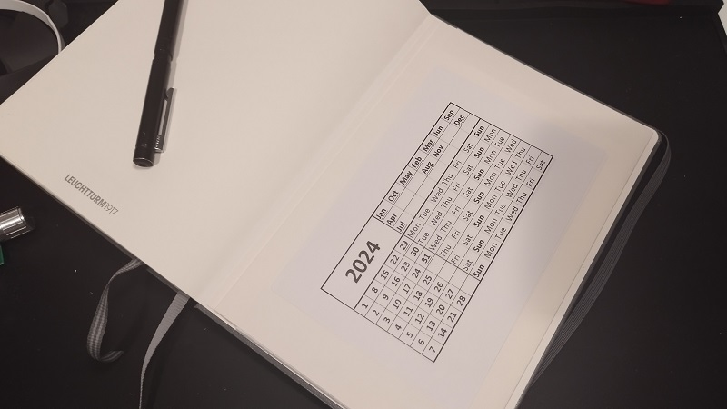

# Compact calendar generator

Allows creating a one-page calendar as described on [this page](https://bigthink.com/starts-with-a-bang/one-page-calendar/).

Simply change the year in the Excel document and the months will be adjusted accordingly. Perfect for printing on shipping labels and stick in a notebook.

Features:
- 31 days months are underlined so you don't have to remember them.
- February is underlined when it's a leap year.
- Grayscale friendly design.

